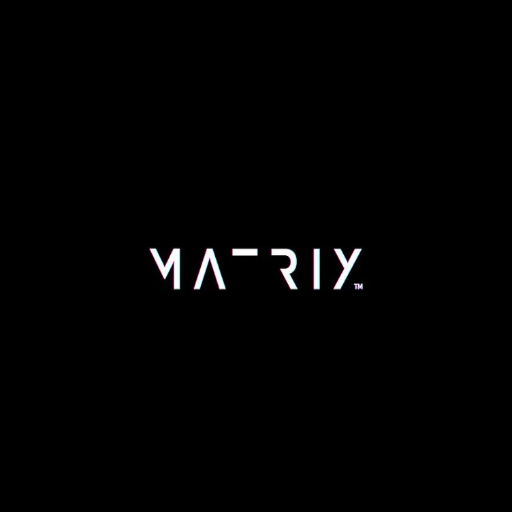

<div align="center">
  <br />
  
  <br />
  <h1>🎨 GitHub Matrix Art Generator</h1>
  <p><strong>Transform your GitHub contribution graph into stunning pixel art!</strong></p>
  
[](https://nextjs.org/)
[](https://www.typescriptlang.org/)
[](https://tailwindcss.com/)
[](LICENSE)
[](https://matrix-art.vercel.app)

  <br />
</div>

## ✨ Features

- 🎯 **60+ Character Support** - Full alphabet, numbers, and symbols
- 🎨 **Real-time Preview** - See your art before creating it
- 📱 **Responsive Design** - Works perfectly on all devices
- 🎭 **Glassmorphism UI** - Beautiful frosted glass effects
- 🚀 **Auto-generated Scripts** - Python scripts for easy execution
- 📋 **Copy & Download** - Instant access to your scripts
- ⚡ **Lightning Fast** - Built with Next.js 15 and TypeScript
- 🌟 **Smooth Animations** - Powered by GSAP

## 🚀 Quick Start

### Prerequisites

- Node.js 18+ 
- npm, yarn, or pnpm

### Installation

1. **Clone the repository**
   ```bash
   git clone https://github.com/AFJAL-HUSSEIN/github-matrix-art.git
   cd github-matrix-art
   ```

2. **Install dependencies**
   ```bash
   npm install
   # or
   pnpm install
   # or
   yarn install
   ```

3. **Start development server**
   ```bash
   npm run dev
   # or
   pnpm dev
   # or
   yarn dev
   ```

4. **Open [http://localhost:3000](http://localhost:3000)** in your browser

## 🎯 How to Use

### Creating Your First Art

1. **Enter Your Text** - Type any word, phrase, or pattern
2. **Adjust Spacing** - Control letter spacing for perfect alignment
3. **Preview** - See your design in real-time
4. **Generate Script** - Get your Python commit script
5. **Execute** - Run the script in a new GitHub repository

### Example Usage

```bash
# 1. Create a new GitHub repository
# 2. Clone it locally
git clone https://github.com/yourusername/your-art-repo.git

# 3. Run the generated script
python github_matrix_art.py

# 4. Push to GitHub
git add .
git commit -m "Add matrix art"
git push origin main

# 5. Check your GitHub profile!
```

## 🎨 Examples

### Text Examples
- **"HELLO"** - Classic greeting
- **"2024"** - Current year
- **"CODE"** - Developer spirit
- **"❤️"** - Heart symbol
- **"AFJAL"** - Your name

### Creative Ideas
- Company logos
- Inspirational quotes
- Special dates
- ASCII art patterns
- Brand names

## 🛠️ Tech Stack

### Frontend
- **Next.js 15** - React framework
- **TypeScript** - Type safety
- **Tailwind CSS** - Utility-first styling
- **GSAP** - Professional animations
- **Lucide React** - Beautiful icons

### Tools & Libraries
- **Geist Fonts** - Modern typography
- **Shadcn/ui** - Reusable components
- **Lenis** - Smooth scrolling
- **React Hook Form** - Form handling

## 📁 Project Structure
    github-matrix-art/
├── app/                    # Next.js app directory
│   ├── globals.css        # Global styles
│   ├── layout.tsx         # Root layout
│   └── page.tsx           # Home page
├── components/            # React components
│   ├── matrix-display.tsx # Matrix visualization
│   ├── script-generator.tsx # Script generation
│   └── ui/                # Shadcn/ui components
├── lib/                   # Utilities
│   ├── matrix-generator.ts # Core algorithm
│   └── utils.ts          # Helper functions
├── public/               # Static assets
│   ├── favicons/         # App icons
│   └── images/           # Images
└── styles/               # Additional styles


## 🎭 Styling

### Color Palette
- **Primary**: `#043222` - Deep forest green
- **Secondary**: `#F6E9D9` - Warm cream
- **Accent**: `#22c55e` - Emerald green
- **Glass**: `rgba(246, 233, 217, 0.4)` - Frosted glass effect

### Design Features
- **Glassmorphism** - Modern frosted glass effects
- **Responsive** - Mobile-first design
- **Dark mode ready** - Easy theme switching
- **Smooth animations** - 60fps animations

## 🌐 SEO Optimized

- ✅ **Meta tags** - Complete OpenGraph and Twitter Cards
- ✅ **Structured data** - JSON-LD schema markup
- ✅ **Favicons** - All platform icons included
- ✅ **Sitemap** - Automatic sitemap generation
- ✅ **Robots.txt** - Search engine friendly

## 🚀 Deployment

### Vercel (Recommended)

[](https://vercel.com/new/clone?repository-url=https://github.com/AFJAL-HUSSEIN/github-matrix-art)

### Docker

```dockerfile
FROM node:18-alpine
WORKDIR /app
COPY package*.json ./
RUN npm ci --only=production
COPY . .
RUN npm run build
EXPOSE 3000
CMD ["npm", "start"]
```

## 🤝 Contributing

We welcome contributions! Please see our [Contributing Guide](CONTRIBUTING.md) for details.

### Quick Contribution Steps

1. **Fork the repository**
2. **Create a feature branch**
   ```bash
   git checkout -b feature/amazing-feature
   ```
3. **Make your changes**
4. **Test thoroughly**
5. **Submit a pull request**

## 📄 License

This project is licensed under the MIT License - see the [LICENSE](LICENSE) file for details.

## 🙏 Acknowledgments

- **GitHub** - For the amazing contribution graph
- **Next.js Team** - For the incredible framework
- **Shadcn/ui** - For beautiful components
- **GSAP** - For smooth animations
- **Open Source Community** - For endless inspiration

## 📞 Support

- **Issues**: [GitHub Issues](https://github.com/AFJAL-HUSSEIN/github-matrix-art/issues)
- **Discussions**: [GitHub Discussions](https://github.com/AFJAL-HUSSEIN/github-matrix-art/discussions)
- **Email**: afjalhussein.ah307@gmail.com

## 🌟 Show Your Support

Give a ⭐️ if this project helped you!

---

<div align="center">
  <p><strong>Made with ❤️ by <a href="https://github.com/AFJAL-HUSSEIN">Afjal Hussein</a></strong></p>
  <p><a href="https://github.com/AFJAL-HUSSEIN/github-matrix-art">⭐ Star this repo</a> • <a href="https://github.com/AFJAL-HUSSEIN/github-matrix-art/fork">🍴 Fork it</a></p>
</div>